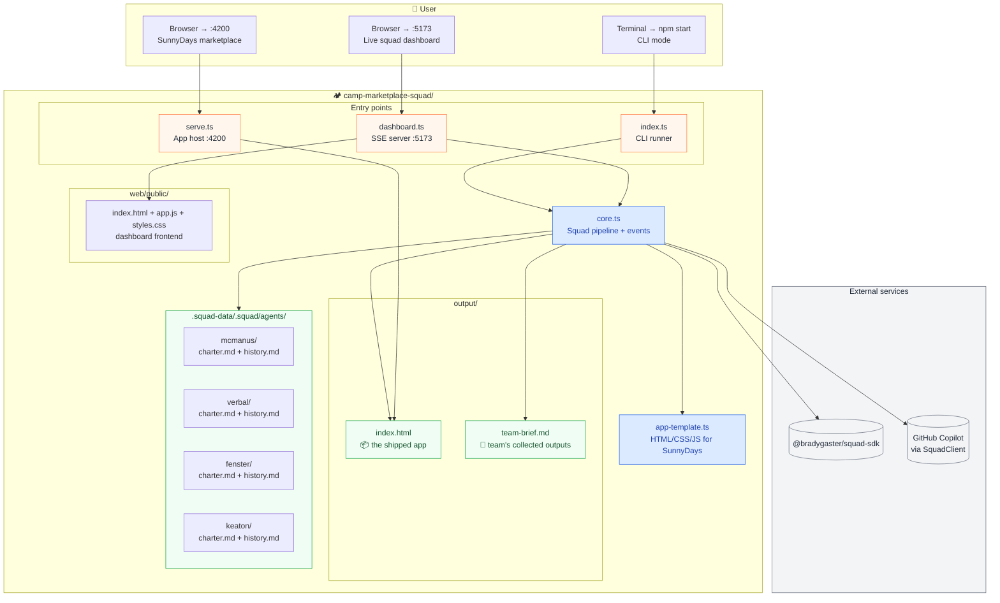
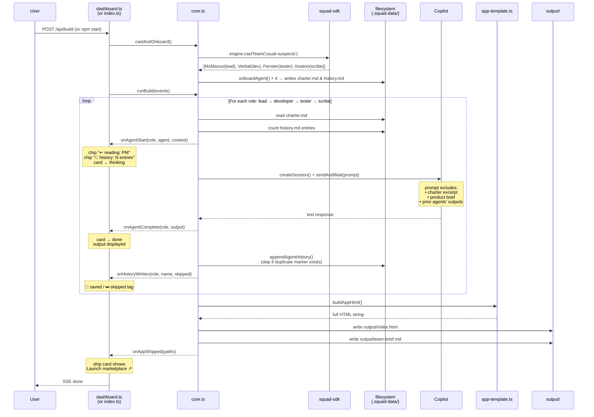
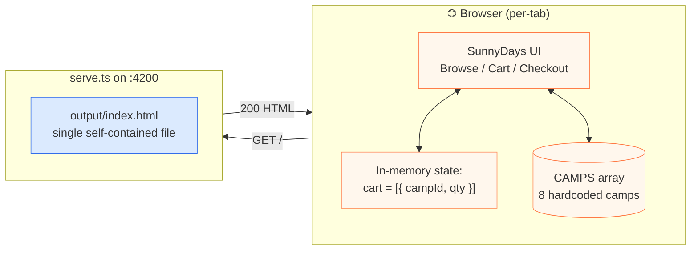
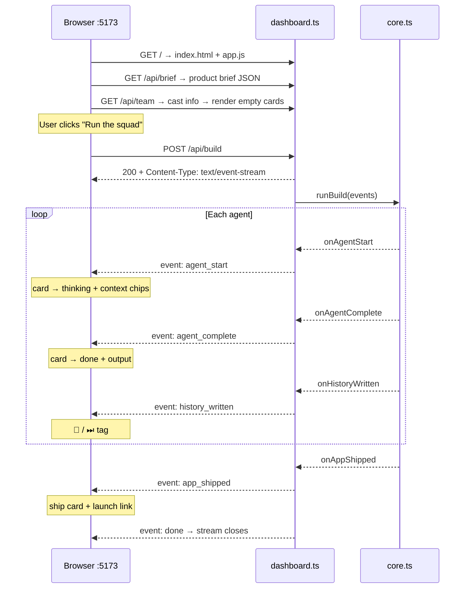

# camp-marketplace-squad — Architecture & Flow

## 1. High-level architecture

Three independent processes, each on its own port, sharing the same workspace files.

### What each file owns

| File | Role | Runs as |
|---|---|---|
| index.ts | Terminal-only entry; orchestrates the squad and prints to stdout | `npm start` |
| dashboard.ts | HTTP + SSE server for the live build UI | `npm run dashboard` (port 5173) |
| serve.ts | Static HTTP server for the shipped marketplace | `npm run serve` (port 4200) |
| core.ts | Shared pipeline: cast → onboard → run each agent → ship the app, with event hooks | imported by all three |
| app-template.ts | The actual product code (HTML/CSS/JS) the Builder ships | imported by core.ts |
| web/public/ | Dashboard frontend (vanilla JS, SSE consumer) | served by dashboard.ts |

---

## 2. Squad build pipeline (per run)

### Key invariants

- **Order is fixed**: `lead → developer → tester → scribe`. Each agent's prompt includes every prior agent's output, so context strictly grows.
- **History is durable**: each role's bullets get appended to that agent's `history.md` exactly once per product. Re-running for the same product skips writes (visible as ⏭ in the dashboard).
- **Cast is deterministic**: same universe + same required roles + same team size → same characters, every run.
- **LLM is in its lane**: Copilot only powers agent *reasoning*. The product data (camps) and product code (HTML) come from `app-template.ts`, not the LLM.

---

## 3. Marketplace runtime (what parents see)

**Notes**

- No backend round-trips after the initial page load. Filtering, add-to-cart, checkout — all client-side JS against the in-memory `cart` array.
- Refreshing the tab clears the cart (the QA Lead flags this in their output).
- Checkout is a mock: a fake order ID is generated from `Date.now()`. No payment processor is contacted.

---

## 4. Dashboard live-update flow (SSE)

The SSE pattern (`text/event-stream` over a long-lived POST response) means the browser gets each agent's output the moment Copilot returns it — no polling, no websockets.
