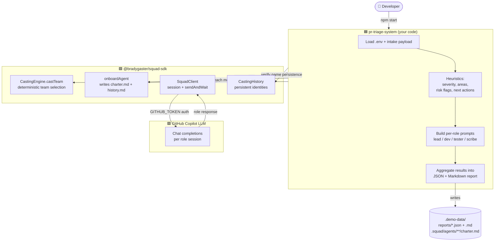

# pr-triage-system — Architecture Overview

High-level view of which layer owns what, and how the demo app reaches the LLM.

> Tip: open the preview in its own tab (`Ctrl+K V`) and zoom with `Ctrl++` if the diagram looks small.

## Layer responsibilities

| Layer | Responsibility |
|---|---|
| 🟦 **pr-triage-system** | Domain logic: intake parsing, severity heuristics, prompt building, report rendering. |
| 🟩 **squad-sdk** | Team casting, agent onboarding, Copilot client/session management, identity history. |
| 🟪 **GitHub Copilot** | The LLM. The SDK talks to it; the app never calls OpenAI/Azure directly. |

See [FLOW.md](FLOW.md) for the step-by-step runtime flow.
