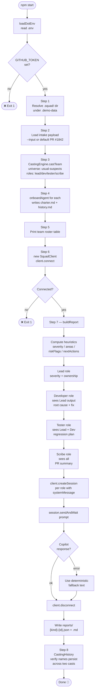

# pr-triage-system — Flow Diagram

Step-by-step runtime flow. For the high-level layering (app vs SDK vs Copilot) see [ARCHITECTURE.md](ARCHITECTURE.md).

```mermaid
flowchart TD
    Start([npm start]) --> LoadEnv[loadDotEnv<br/>read .env]
    LoadEnv --> CheckToken{GITHUB_TOKEN<br/>set?}
    CheckToken -->|no| Exit1([❌ Exit 1])
    CheckToken -->|yes| Step1

    Step1[Step 1<br/>Resolve .squad/ dir<br/>under .demo-data] --> Step2
    Step2[Step 2<br/>Load intake payload<br/>--input or default PR #1842] --> Step3

    Step3[Step 3<br/>CastingEngine.castTeam<br/>universe: usual-suspects<br/>roles: lead/dev/tester/scribe] --> Step4

    Step4[Step 4<br/>onboardAgent for each<br/>writes charter.md + history.md] --> Step5
    Step5[Step 5<br/>Print team roster table] --> Step6

    Step6[Step 6<br/>new SquadClient<br/>client.connect] --> ConnOK{Connected?}
    ConnOK -->|no| Exit2([❌ Exit 1])
    ConnOK -->|yes| Step7

    Step7[Step 7 — buildReport] --> Heur[Compute heuristics<br/>severity / areas /<br/>riskFlags / nextActions]
    Heur --> Lead[Lead role<br/>severity + ownership]
    Lead --> Dev[Developer role<br/>sees Lead output<br/>root cause + fix]
    Dev --> Test[Tester role<br/>sees Lead + Dev<br/>regression plan]
    Test --> Scribe[Scribe role<br/>sees all<br/>PR summary]

    Scribe --> Session[client.createSession<br/>per role with systemMessage]
    Session --> Send[session.sendAndWait prompt]
    Send --> Reply{Copilot<br/>response?}
    Reply -->|ok| Disconnect
    Reply -->|error| Fallback[Use deterministic<br/>fallback text]
    Fallback --> Disconnect
    Disconnect[client.disconnect]

    Disconnect --> Write["Write reports/<br/>{kind}-{id}.json + .md"]
    Write --> Step8[Step 8<br/>CastingHistory<br/>verify names persist<br/>across two casts]
    Step8 --> Done([Done 🎉])
```
